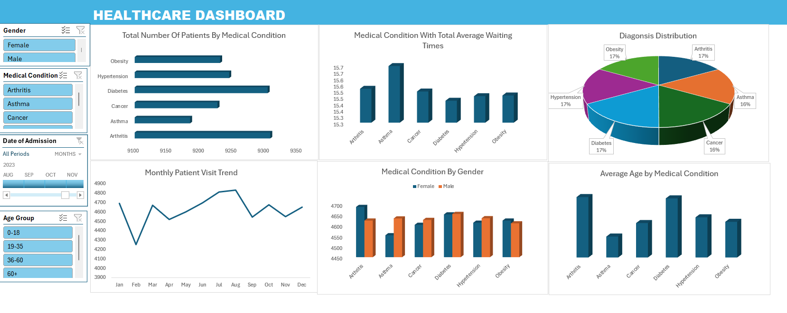
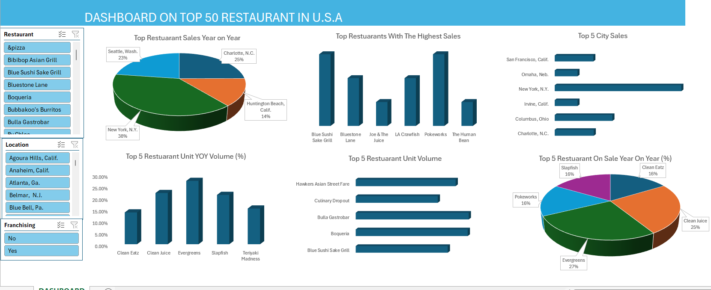
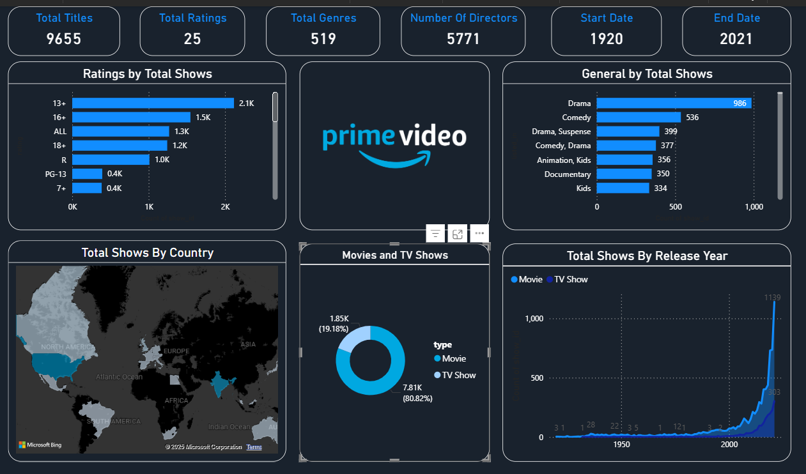
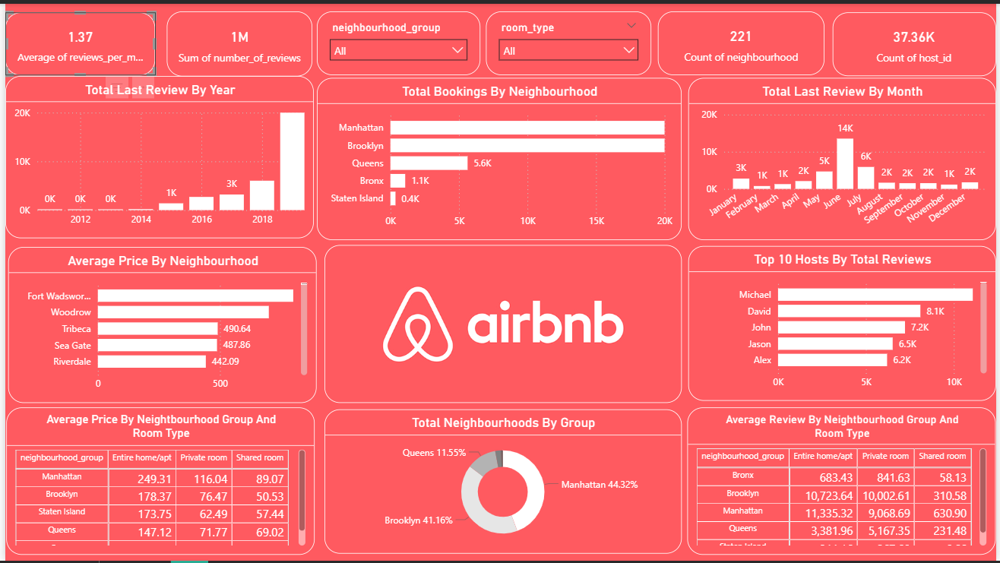

**Project 1**

**Title:** [Healthcare Dashboard](https://github.com/Vick5788/gitihub.io/blob/main/healthcare_dataset%20with%20Dashboard.xlsx)

**Tools Used:** Microsoft excel, Pivot table, Pivot Charts, Conditional Formating, Slicers

**Dashboard Overview:**

**Project Description:** 
This project focused on analyzing patient data and hospital service utilization to evaluate the performance of a healthcare provider. The goal was to present key metrics in a clear and interactive dashboard, supporting strategic planning in patient care, departmental workload, and healthcare outcomes.

The dashboard includes the following features:

*Total number of Patient by Department and Month:* Displays the number of patients seen in each department over time, highlighting busy periods and resource demand.

*Average Wait Time:* Monitors patient wait times per department, enabling identification of bottlenecks and operational inefficiencies.

*Admission Type Breakdown:* Categorizes patients by type of admission (e.g., emergency, referral, self-admission), showing trends and shifts in service usage.

*Treatment Outcome Overview:* Visual representation of patient outcomes (e.g., recovered, ongoing, referred), useful for measuring care effectiveness.

Interactive filters available in the dashboard:

*Department:* Narrow down data to focus on individual clinical units for performance review.

*Admission Type:* Enables analysis based on how patients entered the system.

*Date Range:* Supports time-based comparisons for trend analysis.

**Key Findings:**

*Departmental Load:* Identified high-traffic departments requiring additional resources or support.

*Service Efficiency:* Tracked reductions in wait times in some areas, indicating successful process improvements.

*Admission Patterns:* Uncovered seasonal or campaign-driven surges in referrals or self-admissions.

*Outcome Tracking:* Helped highlight departments with strong or weak patient recovery rates, aiding performance reviews and audits.

This dashboard serves as an essential tool for hospital administrators, giving them actionable insights to drive better resource planning, patient care strategies, and operational efficiency.

 
**Project 2**

**Title:** [Restaurant Sales Performance Dashboard](https://github.com/Vick5788/gitihub.io/blob/main/DASHBOARD%20RESTUARANT.xlsx)

**Tools Used:** Microsoft excel, Pivot table, Pivot Charts, Conditional Formating, Slicers

**Dashboard Overview:**

**Project Description:** This project involved analyzing a restaurant's sales data to uncover performance trends across menu items, order types, and times of day. The objective was to provide the management team with a data-driven dashboard that supports operational decisions, identifies best-selling products, and helps in optimizing the restaurant’s operations and customer service.

The dashboard includes the following features:

*Sales by Category and Menu Item:* A visual breakdown of sales performance across different food categories (e.g., beverages, snacks, desserts) and individual items, identifying which items generate the most revenue.

*Total Revenue per Day:* Tracks daily revenue trends, helping to spot patterns related to weekdays, weekends, and holidays.

*Orders by Hour:* Displays the number of orders across different hours of the day, giving insight into peak business hours and periods of low activity.

*Top-Selling Products:* Ranks menu items based on total units sold and total revenue, making it easier to identify popular items for promotions or stock planning.

Additionally, the dashboard includes interactive slicers for:

*Date:* Allows filtering of data by specific dates or time periods.

*Order Type:* Enables analysis by dine-in, takeaway, or delivery to compare performance across service modes.

*Product Category:* Helps drill down into specific types of menu items for deeper insights.

**Key Findings:**

*Peak Hours Insight:* Identified the busiest hours in the day, enabling better staff allocation and kitchen resource planning.

*Menu Optimization:* Highlighted underperforming items and top-sellers, informing future menu adjustments and promotional campaigns.

*Order Trends by Type:* Revealed that certain menu items performed better in delivery vs. dine-in, aiding targeted service adjustments.

*Daily Revenue Fluctuations:* Helped understand weekday vs. weekend sales performance for strategic staffing and marketing.

This dashboard equips restaurant owners and managers with a robust visual tool to monitor and optimize daily operations, leading to more efficient decision-making and improved customer satisfaction.

**Project 3**

**Title:** Pizza sales analysis project

**SQL Code:**
[Pizza Data] (https://github.com/Vick5788/gitihub.io/blob/main/Pizza.SQL)

**SQL Skills Used:**
Data Retrieval (SELECT): Queried and extracted specific information such as pizza names, order details, and dates from the sales dataset.

Data Aggregation (SUM, COUNT): Calculated total revenue, total pizzas sold, and the number of unique orders to understand sales performance.

Data Filtering (WHERE, BETWEEN, IN, AND): Applied conditional filters to analyze pizza sales by category, date ranges, size, and price thresholds.

Data Source Specification (FROM): Used the pizza_sales table as the primary data source for all analyses.

**Project Description:**
This project focuses on the analysis of a detailed pizza sales dataset to derive business insights using SQL. The primary objective is to extract and summarize key performance indicators such as revenue, order volume, and popular pizza choices.

Data Exploration and Cleaning: Ensure consistency and integrity of the dataset, enabling accurate SQL analysis.

Data Analysis Using SQL: Execute structured queries to analyze different aspects of the business including:

Sales trends (e.g., revenue by month, pizza sizes sold)

Customer preferences (e.g., top-selling pizzas, category-specific performance)

Time-based insights (e.g., sales in specific months or seasons)

Insight Extraction: Discover patterns in pizza sales such as high-performing items, underperforming categories, and seasonal buying behavior.

Reporting: Generate query results that can be visualized in dashboards or reports for stakeholders to support data-driven decisions in marketing and inventory planning.

By the end of the project, the dataset provides a reliable foundation for understanding business performance, helping stakeholders make informed operational and strategic choices.

**Technology used:** SQL server

**Project 4**

**Title:**
[Amazon Prime Video Content Analysis Dashboard](https://github.com/Vick5788/gitihub.io/blob/main/Newportfolio.pbix)

**Tools Used:**
Power BI
Microsoft Bing Maps (for geographic data visualization)

**Dashboard Overview:**

**Project Description:**
This dashboard provides a comprehensive analysis of the content available on Amazon Prime Video from 1920 to 2021. It explores the distribution and trends of titles based on genre, rating, release year, country of origin, and content type (TV Shows vs. Movies). The goal is to understand Prime Video’s content catalog and its evolution over time.

**Key Findings:**

Total of 9,655 titles analyzed, comprising 80.82% TV Shows and 19.18% Movies.

Drama is the most common genre with 986 titles, followed by Comedy and hybrid genres like Drama, Suspense and Comedy, Drama.

The most frequent ratings are 13+, 16+, and ALL, each with over 1,000 titles.

There has been a significant rise in content production in recent years, especially post-2000, peaking in 2021.

Content originates globally, with strong representation from North America, India, and Europe.

A total of 5,771 directors contributed to the catalog, reflecting diversity in content creation.

Dashboard Overview:
The dashboard is structured into key visual sections:

KPI cards at the top for totals (titles, genres, ratings, directors, date range).

Bar charts show breakdowns by genre and rating.

A world map visualizes content distribution by country.

A donut chart displays the proportion of movies vs. TV shows.

A line area chart tracks the number of titles released each year from 1920 to 2021.
The design provides a clear, data-rich snapshot of Prime Video’s catalog and trends.

Certainly! Here's a write-up in the same format for the **Airbnb Power BI Dashboard** you provided:

---

**Project 5**
**Title:** Airbnb Listings Analysis Dashboard

**Tools Used:** Power BI

**Dashboard Overview:** [Airbnb Listings Analysis Dashboard](

**Project Description:**
This dashboard offers an in-depth visual analysis of Airbnb listings in New York City. It highlights booking trends, neighborhood-level performance, pricing structures, and host activity. The goal is to gain actionable insights into customer behavior, listing distribution, and revenue potential across different boroughs and room types.

**Key Findings:**

* Over **1 million reviews** were analyzed, with an **average of 1.37 reviews per month** per listing.
* **Manhattan** and **Brooklyn** dominate bookings with over 18K each, indicating high demand in central and popular areas.
* **221 neighborhoods** and over **37,000 hosts** are represented in the dataset.
* **2019** marked a spike in reviews, suggesting peak activity and platform usage during that year.
* The **highest number of reviews** occurs in **June**, followed by a sharp decline post-summer.
* **Michael** leads among top 10 hosts, with over **9.8K total reviews**, showing strong engagement or listing volume.
* **Fort Wadsworth** and **Woodrow** are the most expensive neighborhoods on average, exceeding **\$500 per night**.
* **Entire home/apartment** listings in Manhattan have the highest average price (\$249.31), while shared rooms remain the cheapest across all boroughs.
* **Queens, Brooklyn, and Manhattan** together make up over **95% of all neighborhoods**, with Brooklyn slightly trailing Manhattan in total share.
* **Manhattan** leads in review count across all room types, showing consistently high customer interaction.

**Dashboard Overview:** 
The dashboard is structured into several core visual sections:

**KPI Cards** for high-level stats (e.g., average reviews, total hosts, number of neighborhoods).
**Bar charts** showing booking volume by neighborhood, host performance, and price comparisons.
**Line and column charts** highlight temporal trends in reviews by year and month.
**Donut chart** illustrates the share of neighborhoods by borough.
**Tables** summarize average prices and reviews segmented by neighborhood group and room type.

The cohesive design and clear segmentation make this dashboard a powerful tool for understanding Airbnb's operational footprint and user behavior across New York City.

